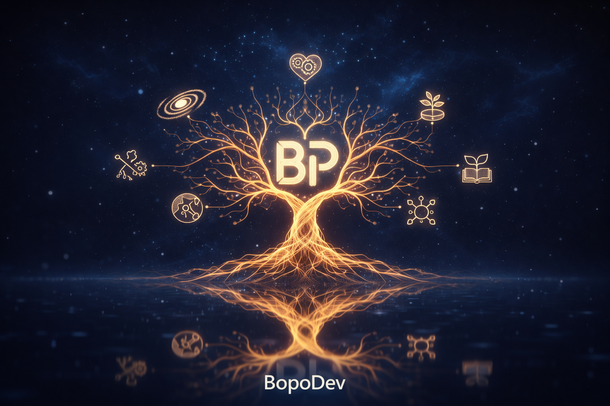

# Bopo



Build with AI agents like a real company, not a pile of terminal tabs.

Bopo is a local-first control plane for teams that want to plan, delegate, approve, and run agent work with confidence.  
If a coding agent is an employee, Bopo is the operating system around that employee.

From one place, you can manage goals, projects, issues, agents, approvals, runs, and cost visibility.

## Who Bopo Is For

- Founders and builders running multiple AI agents across real product work.
- Engineering teams who want clear ownership, accountability, and approvals.
- Operators who need an audit trail for what ran, why it ran, and what it cost.

## Supported CLIs

| CLI | Brand |
| --- | --- |
| Claude Code |  |
| Codex |  |
| OpenCode |  |
| Bash |  |

## How Teams Use Bopo

1. Turn business goals into projects and issues.
2. Hire and configure agents with clear roles and permissions.
3. Review approvals, run heartbeats, and monitor execution from one dashboard.

## What You Get

| Capability | What it does |
| --- | --- |
| Company onboarding | Starts your company with a seeded CEO, starter project, and first issue. |
| Agent lifecycle controls | Create, configure, pause, resume, and terminate agents. |
| Project and issue operations | Assign work, track activity, add comments, and keep context together. |
| Heartbeat execution | Run agents on demand or in sweeps with stop/resume/redo controls. |
| Governance approvals | Route high-impact actions through explicit approval workflows. |
| Operational visibility | See runs, trace logs, and cost signals in one place. |
| Realtime coordination | Stream governance and office-space updates while work is running. |
| Local-first runtime | Run locally with embedded persistence and workspace-aware execution. |

## Why It Feels Better

| Without Bopo | With Bopo |
| --- | --- |
| Agent work gets lost across terminals, chats, and notes. | Work is organized by company, project, and issue. |
| Ownership and execution state are hard to track. | Roles, approvals, and status are explicit and auditable. |
| Costs and run history are painful to piece together. | Runs, traces, and cost signals are visible in one control plane. |

## What Bopo Is Not

- **Not a chat wrapper**: Bopo is built for structured execution, not ad hoc prompting.
- **Not a single-agent toy**: it is designed for multi-agent orgs with clear accountability.
- **Not a generic workflow builder**: it focuses on operating AI teams like a company.
- **Not a replacement for your coding agent**: it coordinates agents; it does not replace them.

## Quickstart

```bash
npx bopodev onboard
```

Then open `http://localhost:4010`, create a project, assign an issue, and run your first heartbeat.

## Documentation

- Docs home: [`docs/index.md`](./docs/index.md)
- Getting started: [`docs/getting-started-and-dev.md`](./docs/getting-started-and-dev.md)
- Product guides: [`docs/product/index.md`](./docs/product/index.md)
- Developer references: [`docs/developer/index.md`](./docs/developer/index.md)
- Operations runbooks: [`docs/operations/index.md`](./docs/operations/index.md)
- Release docs: [`docs/release/index.md`](./docs/release/index.md)
- Workspace/path canonical model: [`docs/developer/workspace-resolution-reference.md`](./docs/developer/workspace-resolution-reference.md)
- Workspace migration/backfill runbook: [`docs/operations/workspace-migration-and-backfill-runbook.md`](./docs/operations/workspace-migration-and-backfill-runbook.md)
